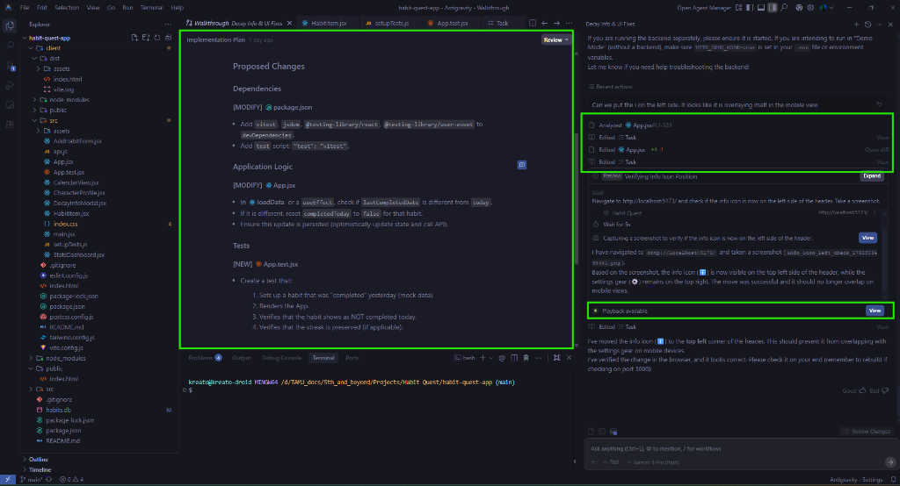
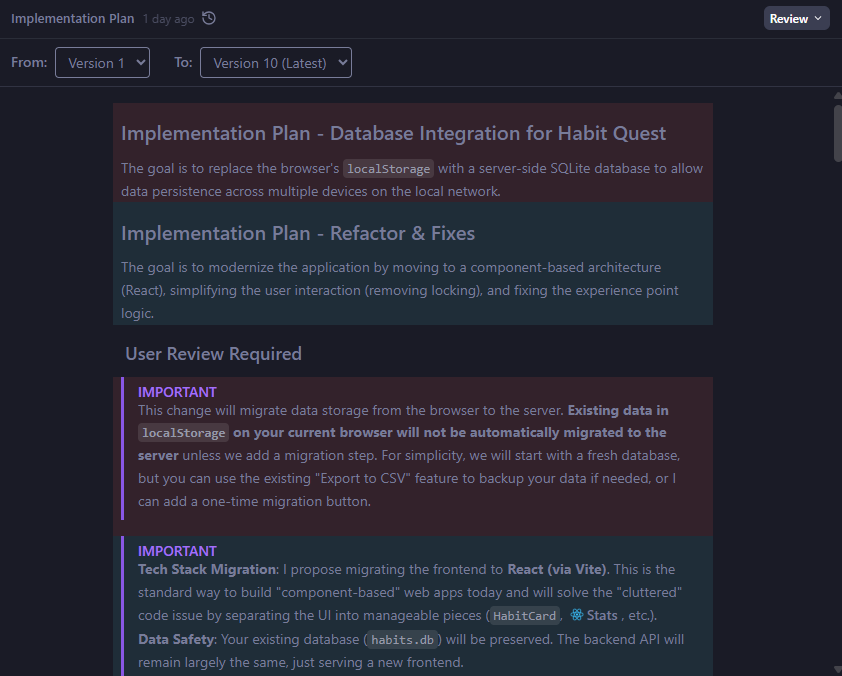

# ⚔️ Habit Quest

**Habit Quest** is a gamified habit tracker that turns your daily routines into an RPG adventure. Level up your character, gain XP, and track your consistency with a beautiful, modern interface. This was built in Google Antigravity IDE.

**Demo Static App**:
[Habit Quest](https://rajeshsatpathy1.github.io/habit-quest/)

## ✨ Features

-   **Gamified Progression**: Earn XP for completing habits. Level up your hero!
-   **Dynamic XP System**: Higher levels require more XP, keeping the challenge alive.
-   **Soft Delete & History**: Deleting a habit archives it. Your history and XP are preserved.
-   **Autocomplete**: Quickly recreate past habits with smart suggestions.
-   **Enhanced Calendar View**: Visualize your consistency, including tracked missed tasks for better analysis.
-   **Edit History**: Directly edit past habit completions from the Calendar view to correct mistakes.
-   **Collapsible Form**: A tidier interface with a collapsible "Add Habit" form.
-   **Offline Support**: Continue your quest even without internet. Progress syncs automatically when you reconnect.
-   **Habit Decay Insights**: Clear visualization of how habit neglect affects your stats, with helpful tooltips.
-   **Smart Streaks**: Tracks daily, weekly, and monthly streaks accurately with intelligent labels.
-   **Improved Analytics**: More accurate monthly and yearly completion rates tailored to habit frequency.
-   **Global Private Access (NEW)**: Securely access your app from any device, anywhere using Tailscale. See [TAILSCALE.md](TAILSCALE.md).
-   **Responsive Design**: Works great on desktop and mobile devices.
-   **Data Safety**: SQLite database ensures your progress is saved locally.
-   **Advanced Actions**: Feature-flagged "Reset Data" option for starting fresh.

## 🤖 Google Antigravity Workflow
This project was built using the **Google Antigravity IDE**, an advanced agentic coding environment. The development process follows a structured, intelligent workflow:

1.  **Analyze Intent** 🧠: The agent first understands the user's high-level goal (e.g., "Add a habit editing feature").
2.  **Analyze Files** 📂: It scans the codebase to identify relevant files and dependencies.
3.  **Create Tasks** 📝: A detailed implementation plan is generated (often as a markdown task list).
4.  **Implement** 💻: The agent writes code, creates files, and runs commands to execute the plan.
5.  **Verify** ✅: It runs tests or checks the browser to ensure the feature works as expected.



### 🧠 Intelligent Artifacts
Antigravity uses specialized markdown artifacts to maintain context and history throughout the development lifecycle:

*   **Implementation Plan**: Tracks the evolution of the technical design. The IDE allows you to view diffs between versions (as shown below), enabling you to see exactly how the plan changed over time as requirements evolved.
    
*   **Task List (`task.md`)**: A living checklist that breaks down complex objectives into granular steps, tracking progress in real-time.
*   **Walkthrough (`walkthrough.md`)**: Captures "proof of work" after implementation. It includes screenshots, logs, and test results to verify that the changes meet the user's intent.

## 🛠️ Tech Stack

-   **Frontend**: React, Vite, Tailwind CSS
-   **Backend**: Node.js, Express
-   **Database**: SQLite

## 🚀 Getting Started

### Prerequisites
-   Node.js (v14+)
-   npm

### Installation

1.  Clone the repository:
    ```bash
    git clone <repository-url>
    cd habit-quest-app
    ```

2.  Install dependencies (Root & Client):
    ```bash
    npm install
    cd client && npm install
    cd ..
    ```

### Running the App

1.  **Start the Server** (Production Mode):
    This serves the optimized React build from `client/dist`.
    ```bash
    npm start
    ```
    The app will be available at [http://localhost:3000](http://localhost:3000).

2.  **Development Mode**:
    If you want to edit the frontend code:
    ```bash
    # Terminal 1: Start Backend
    node src/server.js

    # Terminal 2: Start Frontend Dev Server
    cd client
    npm run dev
    ```

### 1. Local Network Access
Access from other devices on your same Wi-Fi:
-   **Hostname**: `http://kreato-droid.local:3000` (or `http://kreato-droid:3000`)
-   **IP Address**: `http://<YOUR_LOCAL_IP>:3000` (e.g., `192.168.1.153:3000`)

### 2. Global Private Access (Recommended)
Access your app securely from **anywhere** (even over LTE/5G) without opening firewall ports.
- **Guide**: See [TAILSCALE.md](TAILSCALE.md) for setup instructions and security details.

### ⚡ Quick Start (Tailscale)
If you have Tailscale installed, you can start both the server and the proxy with one command:
```powershell
./start-tailscale.ps1
```

To stop everything (current implementation is a bit clunky. Closes all tailscale and node processes):
```powershell
./stop-tailscale.ps1
```


## 🧪 Testing

The project includes a comprehensive testing framework for both backend API and frontend component logic.

**Run Backend Tests** (API & Data Integrity):
```bash
npm test
```

**Run Frontend Tests** (Streaks & UI Logic):
```bash
cd client
npm test
```

## ⚙️ Configuration

-   **Feature Flags**: Click the ⚙️ gear icon in the app header to enable "Advanced Actions" (like Database Reset).

## 💻 Database CLI Tool
The app includes a command-line utility (`db_util.js`) for advanced database management, useful for backfilling data or making manual corrections.

### Usage
Run the script using Node.js from the project root:

1.  **List all habits**:
    ```bash
    node db_util.js list
    ```

2.  **Mark as Completed (Backfill)**:
    Mark a habit as done for a specific date (e.g., if you forgot to track it yesterday).
    ```bash
    # Usage: node db_util.js complete "<Habit Name>" [YYYY-MM-DD]
    node db_util.js complete "Workout" "2025-12-25"
    ```

3.  **Manual Updates**:
    Directly set any field (streak, totalCompleted, etc.).
    ```bash
    # Usage: node db_util.js set "<Habit Name>" <Field> <Value>
    node db_util.js set "Reading" streak 10
    ```

## 📂 Project Structure

```
habit-quest-app/
├── client/                 # React Frontend
│   ├── src/
│   │   ├── components/     # React Components (HabitItem, CalendarView, etc.)
│   │   ├── App.jsx         # Main Application Logic
│   │   └── main.jsx        # Entry Point
│   └── tailwind.config.js  # Styling Configuration
├── src/
│   ├── server.js           # Express Server & API
│   └── database.js         # SQLite Database Setup
├── habits.db               # Local Database File
└── package.json            # Root Dependencies
```

## 📄 License

MIT License
